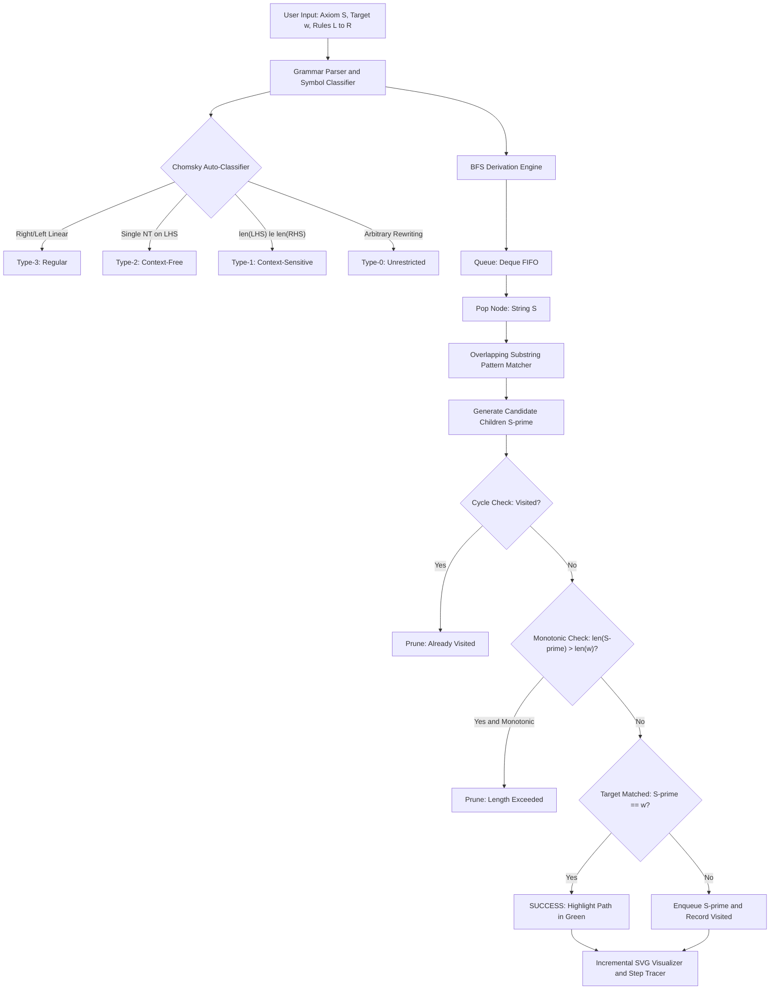
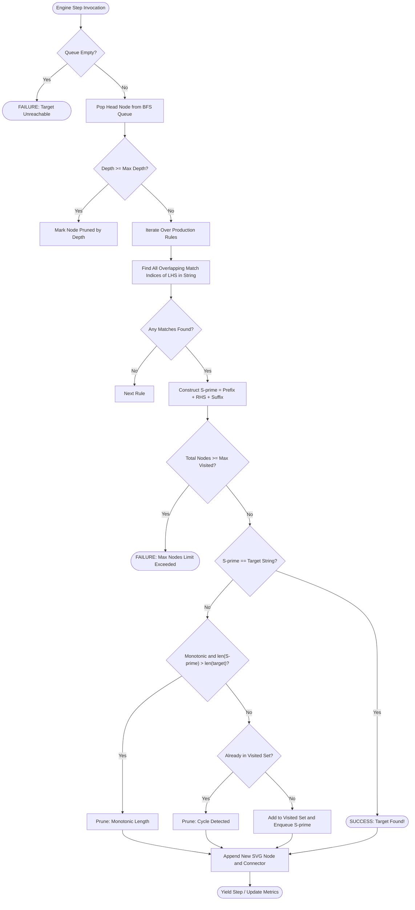

This is a project made during the summer which I am just now uploading after finishing everything and having to focus on more important, school projects. There's no commits to show the progress of this repo because:
1. Didn't know how to use git when I made this
2. Kept and hosted it locally instead of relying on github pages

A browser-based playground for formal grammars and string rewriting systems. You input production rules and a target string, click Recognise, and watch the derivation tree build itself in real time using a non-deterministic Breadth-First Search across all possible rule applications.

The tool covers the full Chomsky hierarchy from Type-3 (Regular) up to Type-0 (Unrestricted / Semi-Thue systems), auto-detects which tier your grammar belongs to, and prunes dead branches keep it fast.

<h2> DOCUMENTATION </h2>

### Key Features

- **Auto-classification** - paste in your rules and the app immediately tells you whether the grammar is Regular, Context-Free, Context-Sensitive, or Unrestricted, with a diagnostic breakdown explaining why.
- **Non-deterministic BFS engine** - finds every overlapping occurrence of every LHS pattern in the current string, branches on all of them simultaneously, and finds the shortest derivation path to the target.
- **Cycle and length pruning** - a visited-set blocks revisiting identical strings; for monotonic grammars any branch that grows longer than the target is killed immediately. This should eliminate the vast majority of dead branches without missing valid paths.
- **Incremental SVG tree** - nodes and edges appear one by one as the search runs. You can pan (drag), zoom (scroll wheel or toolbar), and click any node to inspect it.
- **Live execution controls** - use Step to render one expansion at a time, run continuously with an adjustable speed slider, pause mid-run, or clear and start over without reloading the page.
- **Derivation tracer** - a step-by-step panel shows the exact rule applied at each step, with the inserted substring highlighted inline.
- **Theory tab** - a built-in reference guide covering the hierarchy, automata models, undecidability, and one-click preset loaders.

---

## System Architecture

### Application Pipeline

The following flowchart shows how input moves from the rule editor through to the SVG canvas:

---

### BFS Derivation Engine

Per-step branching and pruning logic in detail:

---

## The Chomsky Hierarchy

### The Four Tiers

A formal grammar is a set of rewriting rules over an alphabet. Chomsky's hierarchy sorts these grammars into four tiers based on how restrictive the rules are, and each tier corresponds to a different class of machine that can recognise it.

The hierarchy was introduced by Noam Chomsky in 1956 and remains foundational to compiler design, computability theory, and linguistics.

A grammar is defined as a 4-tuple **G = (V, Σ, P, S)** where:
- **V** — non-terminal symbols (uppercase letters by convention, e.g. S, A, B)
- **Σ** — terminal symbols (the actual output characters, e.g. a, b, 0, 1)
- **P** — production rules of the form LHS → RHS
- **S** — the start symbol (axiom)

### Comparison Table

| Tier | Class | Rule Constraint | Recognising Machine | Recognition Complexity | Decidable? |
| :---: | :--- | :--- | :--- | :---: | :---: |
| **Type-3** | Regular | `A → wB` or `A → w` (right-linear), or `A → Bw` / `A → w` (left-linear). At most one non-terminal, always at the end or start of RHS. | Finite State Automaton (DFA / NFA) | O(n) — linear scan | Yes |
| **Type-2** | Context-Free | `A → γ` where A is a single non-terminal and γ is any string of terminals and non-terminals. LHS is always exactly one symbol. | Pushdown Automaton (PDA) | O(n³) — CYK or Earley | Yes |
| **Type-1** | Context-Sensitive | `αAβ → αγβ` — a non-terminal A in context (α, β) can be replaced by γ, but the rule must not shrink the string (LHS length ≤ RHS length). | Linear Bounded Automaton (LBA) | PSPACE-complete | Yes |
| **Type-0** | Unrestricted / Semi-Thue | `α → β` — any non-empty string on the LHS can be rewritten to anything, including the empty string. No constraints. | Turing Machine | Undecidable | No; equivalent to the Halting Problem |

---

### Semi-Thue String Rewriting

Axel Thue studied string rewriting systems in 1914, long before formal language theory existed as a field. A Semi-Thue system is just a set of directed rules over an alphabet, basically "if you see u, you may replace it with v" is what constitues Type-0 grammars.

#### Non-determinism and branching

The tricky part is that a rule's LHS pattern might appear multiple times in the current string, or multiple different rules might all be applicable at once. The engine branches on every possibility - if `S → aSb` and the current string is `aSb`, it applies the rule at every valid position, producing separate child nodes for each.

#### Confluence

A system is *confluent* (or Church-Rosser) if any two diverging derivation paths can always be rejoined i.e. if `w` rewrites to both `w1` and `w2`, there's always some `w3` that both can reach. Most unrestricted systems are not confluent, which is part of what makes them Turing-complete and undecidable.

---

### Why BFS? Why Pruning?

**BFS guarantees the shortest derivation.** Since each rule application costs one step, BFS naturally finds the path with the fewest rewrites first. DFS would obviously just dive down one branch indefinitely before trying alternatives, which would work for grammars that always terminate, but obviously not for recursive or cyclic rules like `S → aSb`.

**Monotonic length pruning** works because in Type-1, Type-2, and Type-3 grammars, rules never shrink strings. So if the current string is already longer than the target, it can only get longer and it will never match. The engine drops those branches immediately without expanding them.

**The undecidability barrier** — for Type-0 systems, rules can shrink strings (e.g. `ab → ε`). There's no general way to know whether a target is reachable without potentially running forever. The app works around this with configurable hard limits on BFS depth and total node count.

**Canvas performance note** — if the derivation tree grows very large and you zoom out to view the full graph, browsing and panning through the tree will become laggy due to the high density of rendered SVG nodes and edges.

---

## Presets

The app comes with seven  grammars:

| Preset | Tier | Start | Target | Rules | Steps |
| :--- | :---: | :---: | :---: | :--- | :---: |
| **aⁿbⁿ** | Type-2 | `S` | `aabb` | `S → aSb`, `S → ε` | 3 |
| **Balanced Parentheses (Dyck)** | Type-2 | `S` | `()(())` | `S → (S)S`, `S → ε` | 5 |
| **Palindromes over {a, b}** | Type-2 | `S` | `ababa` | `S → aSa \| bSb \| a \| b \| ε` | 3 |
| **Alternating (ab)⁺** | Type-3 | `S` | `abab` | `S → aA`, `A → bS \| b` | 3 |
| **aⁿbⁿcⁿ** | Type-1 | `S` | `aabbcc` | `S → aSBC \| aBC`, `CB → BC`, `aB → ab`, `bB → bb`, `bC → bc`, `cC → cc` | 7 |
| **Binary Incrementer** | Type-0 | `>1011+` | `1100` | `0+ → 1`, `1+ → +0`, `>+ → >1`, `> → ε` | 4 |
| **String Reversal** | Type-0 | `#abc` | `cba` | `#a → A#`, `#b → B#`, `#c → C#`, `A# → #A`, etc. | 6 |

### Controls
- **Recognise** — starts the live animated search. Runs at the speed set by the Step Delay slider.
- **Step** — advances by exactly one BFS expansion.
- **Clear Tree** — wipes the derivation tree canvas and resets the engine state without altering your rules.
- **Pause** — pauses the live derivation search.
- **Reset Rules** — restores the default aⁿbⁿ grammar.
- **Step Delay slider** — controls animation speed from 30ms (very fast) to 1000ms (pretty slow).

